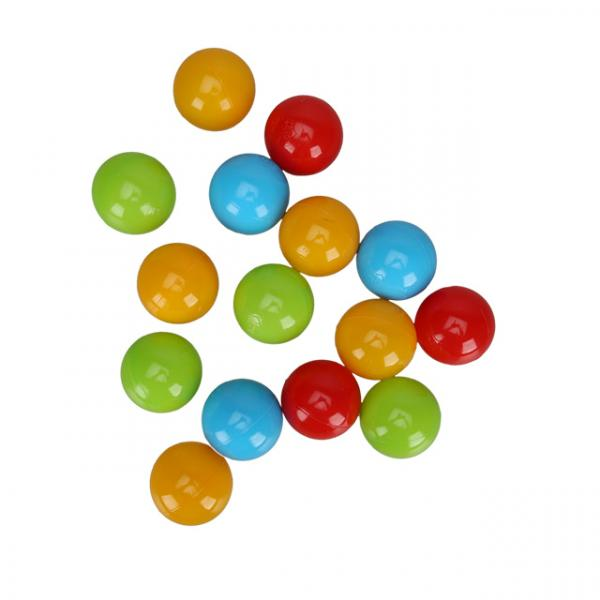
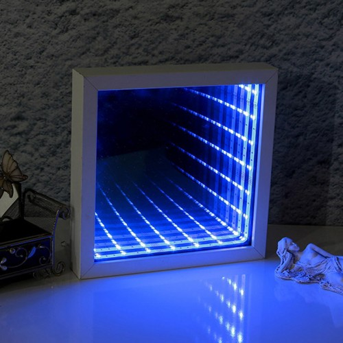
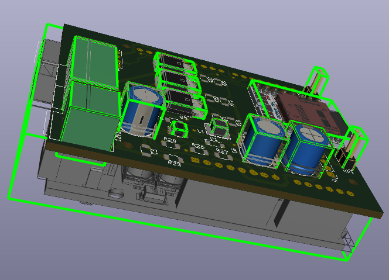
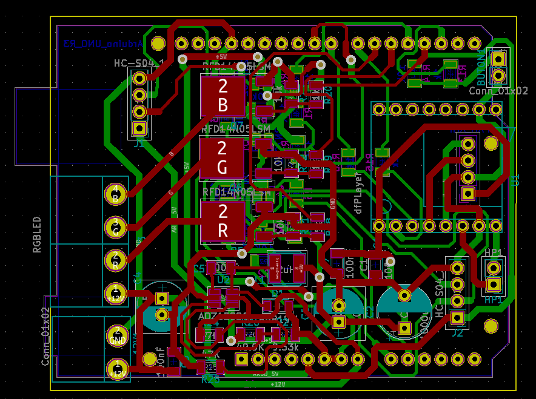

<h1 align="center">PIXY2 Ball Colour Detect </h1>
<p  align="center">
    
</p>

## İçerik

- [Overview](#Overview)
- [How it works?](#How-it-works)
- [Used technologies](#Used-technologies)

## Overview

In this study, by using the Pixy2 camera, the colours of small balls consisting of 6 colours in total, red, blue, green, white, yellow and orange, are recognized when thrown in front of the camera and their colours are reflected aloud by reflecting them on an infinite mirror.
Thus, it is aimed to make it easier for young children (1-5 years old) to learn colours through a game scenario.

<p  align="center">
    
</p>


## How it works?

Arduino UNO controls the system. Coloured balls are introduced to the Pixy2 camera via PC software. Different operating modes and appropriate game scenarios have been developed. The colours of the recognized balls are displayed audibly and with RGB LEDs on the infinite mirror.

<p  align="center">
    
</p>
The Pixy camera is mounted on the tops of the registered mechanics (looking from top to bottom) as the playground. There is an infinite mirror opposite the place where the ball is thrown. How long should the top shooting direction be in front of the top camera? It is recommended that the side walls be closed or covered to prevent the camera from being affected by the sun.

Example Scenario:

When the player passes in front of the field and reaches the appropriate distance according to the information received from the distance sensors, a random sound is given to attract the player's attention. When the player gets close enough, the system tells him to throw a ball. The ball colour is told by the system and displayed on the infinite mirror. Thus the game begins. First, the colours of the ball thrown are told, then balls of different colours are asked to be thrown, and the player is given points for each colour he knows.

The number of colours to be displayed can be increased by different hardware features. Here, colours that can be displayed with RGB strip LEDs are preferred. It is also preferred that these colours are primary colours.

<p  align="center">
    
</p

Game duration, mode selection, etc. The settings indicate that the audio warning continues with the help of a button.


<br>
<p  align="center">
    

</p>

## Used technologies

```bash
- ARDUINO UNO.
- C++.
- PIXY2 detect colour.
- RGB strip led drivers.
- KiCad PCB design.

```


- GitHub [@your-ilyas9461](https://github.com/ilyas9461)
- Linkedin [@your-linkedin](https://www.linkedin.com/in/ilyas-yağcioğlu-6a6b17217)

